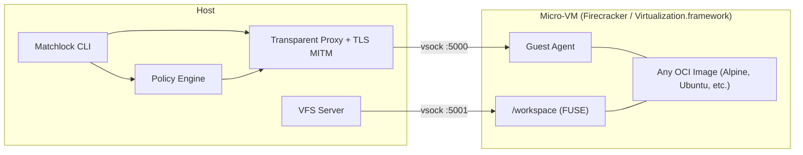

# Matchlock

Matchlock is a CLI tool for running AI agents in ephemeral micro-VMs - with network allowlisting, secret injection via MITM proxy, and everything else blocked by default. Your secrets never enter the VM.

## Why Matchlock?

Every command runs inside its own micro-VM - Firecracker on Linux, Virtualization.framework on macOS - booting in under a second from any OCI image you throw at it.

Only the hosts you allowlist are reachable. Everything else is blocked. When your agent calls an API, a transparent MITM proxy injects the real credentials in-flight - the VM itself never sees them.

The workspace is a FUSE-mounted overlay filesystem with copy-on-write, so the host stays clean. And it all works identically on Linux (x86_64) and macOS (Apple Silicon).

## Quick Start

### Prerequisites

- [mise](https://mise.jdx.dev/)
- `e2fsprogs` (`mke2fs`, `debugfs`, `resize2fs`)
- **Linux**: KVM support
- **macOS**: Apple Silicon

### Install

```bash
git clone https://github.com/jingkaihe/matchlock.git && cd matchlock
mise install

# macOS
mise run darwin:setup

# Linux
mise run setup
```

### Usage

```bash
# Basic
matchlock run --image alpine:latest cat /etc/os-release
matchlock run --image alpine:latest -it sh

# Network allowlist
matchlock run --image python:3.12-alpine \
  --allow-host "api.openai.com" python agent.py

# Secret injection (never enters the VM)
export ANTHROPIC_API_KEY=sk-xxx
matchlock run --image python:3.12-alpine \
  --secret ANTHROPIC_API_KEY@api.anthropic.com python call_api.py

# Long-lived sandboxes
matchlock run --image alpine:latest --rm=false   # prints VM ID
matchlock exec vm-abc12345 -it sh                # attach to it

# Lifecycle
matchlock list | kill | rm | prune
```

## SDK

Beyond the CLI, Matchlock ships with Go and Python SDKs for embedding sandboxes directly in your application. Launch a VM, exec commands, stream output, and write files - all programmatically.

**Go**

```go
import "github.com/jingkaihe/matchlock/pkg/sdk"

client, _ := sdk.NewClient(sdk.DefaultConfig())
defer client.Close()

sandbox := sdk.New("python:3.12-alpine").
    AllowHost("api.anthropic.com").
    AddSecret("ANTHROPIC_API_KEY", os.Getenv("ANTHROPIC_API_KEY"), "api.anthropic.com")

client.Launch(sandbox)

// The VM only ever sees a placeholder - the real key never enters the sandbox
result, _ := client.Exec("echo $ANTHROPIC_API_KEY")
fmt.Print(result.Stdout) // prints "SANDBOX_SECRET_a1b2c3d4..."

client.WriteFile("/workspace/ask.py", script)
client.ExecStream("uv run /workspace/ask.py", os.Stdout, os.Stderr)
```

**Python**

```python
from matchlock import Client, Config, Sandbox

sandbox = (
    Sandbox("python:3.12-alpine")
    .allow_host("api.anthropic.com")
    .add_secret("ANTHROPIC_API_KEY", os.environ["ANTHROPIC_API_KEY"], "api.anthropic.com")
)

with Client(Config()) as client:
    client.launch(sandbox)
    client.write_file("/workspace/ask.py", script)
    client.exec_stream("uv run /workspace/ask.py", stdout=sys.stdout, stderr=sys.stderr)
```

See full examples in [`examples/go`](examples/go/main.go) and [`examples/python`](examples/python/main.py).

## Architecture



### Network Modes

| Platform | Mode | Mechanism |
|----------|------|-----------|
| Linux | Transparent proxy | nftables DNAT on ports 80/443 |
| macOS | NAT (default) | Virtualization.framework built-in NAT |
| macOS | Interception (with `--allow-host`/`--secret`) | gVisor userspace TCP/IP at L4 |

## Docs

See [AGENTS.md](AGENTS.md) for the full developer reference.

## License

MIT
