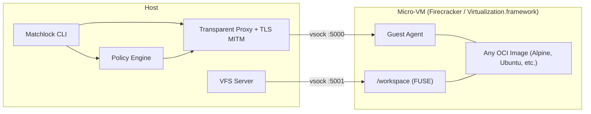

# Matchlock

> **Experimental:** This project is still in active development and subject to breaking changes.

Matchlock is a CLI tool for running AI agents in ephemeral microVMs - with network allowlisting, secret injection via MITM proxy, and VM-level isolation. Your secrets never enter the VM.

## Why Matchlock?

AI agents need to run code, but giving them unrestricted access to your machine is a risk. Matchlock lets you hand an agent a full Linux environment that boots in under a second - isolated and disposable.

When you pass `--allow-host` or `--secret`, Matchlock seals the network - only traffic to explicitly allowed hosts gets through, and everything else is blocked. When your agent calls an API the real credentials are injected in-flight by the host. The sandbox only ever sees a placeholder. Even if the agent is tricked into running something malicious your keys don't leak and there's nowhere for data to go. Inside the agent gets a full Linux environment to do whatever it needs. It can install packages and write files and make a mess. Outside your machine doesn't feel a thing. Volume overlay mounts are isolated snapshots that vanish when you're done. Same CLI and same behaviour whether you're on a Linux server or a MacBook.

## Quick Start

### System Requirements

- **Linux** with KVM support
- **macOS** on Apple Silicon

### Install

```bash
brew tap jingkaihe/essentials
brew install matchlock
```

### Usage

```bash
# Basic
matchlock run --image alpine:latest cat /etc/os-release
matchlock run --image alpine:latest -it sh

# Network allowlist
matchlock run --image python:3.12-alpine \
  --allow-host "api.openai.com" python agent.py

# Secret injection (never enters the VM)
export ANTHROPIC_API_KEY=sk-xxx
matchlock run --image python:3.12-alpine \
  --secret ANTHROPIC_API_KEY@api.anthropic.com python call_api.py

# Long-lived sandboxes
matchlock run --image alpine:latest --rm=false   # prints VM ID
matchlock exec vm-abc12345 -it sh                # attach to it
matchlock port-forward vm-abc12345 8080:8080     # forward host:8080 -> guest:8080

# Publish ports at startup
matchlock run --image alpine:latest --rm=false -p 8080:8080

# Lifecycle
matchlock list | kill | rm | prune

# Build from Dockerfile (uses BuildKit-in-VM)
matchlock build -f Dockerfile -t myapp:latest .

# Pre-build rootfs from registry image (caches for faster startup)
matchlock build alpine:latest

# Image management
matchlock image ls                                           # List all images
matchlock image rm myapp:latest                              # Remove a local image
docker save myapp:latest | matchlock image import myapp:latest  # Import from tarball
```

## SDK

Matchlock also ships with Go and Python SDKs for embedding sandboxes directly in your application. Allows you to programmatically launch VMs, exec commands, stream output and write files.

**Go**

```go
package main

import (
	"context"
	"fmt"
	"os"

	"github.com/jingkaihe/matchlock/pkg/sdk"
)

func main() {
	client, _ := sdk.NewClient(sdk.DefaultConfig())
	defer client.Close()

	sandbox := sdk.New("alpine:latest").
		AllowHost("dl-cdn.alpinelinux.org", "api.anthropic.com").
		AddSecret("ANTHROPIC_API_KEY", os.Getenv("ANTHROPIC_API_KEY"), "api.anthropic.com")

	client.Launch(sandbox)
	client.Exec("apk add --no-cache curl")

	// The VM only ever sees a placeholder - the real key never enters the sandbox
	result, _ := client.Exec("echo $ANTHROPIC_API_KEY")
	fmt.Print(result.Stdout) // prints "SANDBOX_SECRET_a1b2c3d4..."

	curlCmd := `curl -s --no-buffer https://api.anthropic.com/v1/messages \
  -H "content-type: application/json" \
  -H "x-api-key: $ANTHROPIC_API_KEY" \
  -H "anthropic-version: 2023-06-01" \
  -d '{"model":"claude-haiku-4-5-20251001","max_tokens":1024,"stream":true,
       "messages":[{"role":"user","content":"Explain TCP to me"}]}'`
	client.ExecStream(curlCmd, os.Stdout, os.Stderr)
}
```

Go SDK private-IP behavior (`10/8`, `172.16/12`, `192.168/16`):

- Default (unset): private IPs are blocked whenever a network config is sent.
- Explicit block: call `.WithBlockPrivateIPs(true)` (or `.BlockPrivateIPs()`).
- Explicit allow: call `.AllowPrivateIPs()` or `.WithBlockPrivateIPs(false)`.

```go
sandbox := sdk.New("alpine:latest").
	AllowHost("api.openai.com").
	AddHost("api.internal", "10.0.0.10").
	WithNetworkMTU(1200).
	AllowPrivateIPs() // explicit override: block_private_ips=false
```

If you use `client.Create(...)` directly (without the builder), set:
- `BlockPrivateIPsSet: true`
- `BlockPrivateIPs: false` (or `true`)

**Python** ([PyPI](https://pypi.org/project/matchlock/))

```bash
pip install matchlock
# or
uv add matchlock
```

```python
import os
import sys

from matchlock import Client, Config, Sandbox

sandbox = (
    Sandbox("alpine:latest")
    .allow_host("dl-cdn.alpinelinux.org", "api.anthropic.com")
    .add_secret(
        "ANTHROPIC_API_KEY", os.environ["ANTHROPIC_API_KEY"], "api.anthropic.com"
    )
)

curl_cmd = """curl -s --no-buffer https://api.anthropic.com/v1/messages \
  -H "content-type: application/json" \
  -H "x-api-key: $ANTHROPIC_API_KEY" \
  -H "anthropic-version: 2023-06-01" \
  -d '{"model":"claude-haiku-4-5-20251001","max_tokens":1024,"stream":true,
       "messages":[{"role":"user","content":"Explain TCP/IP."}]}'"""

with Client(Config()) as client:
    client.launch(sandbox)
    client.exec("apk add --no-cache curl")
    client.exec_stream(curl_cmd, stdout=sys.stdout, stderr=sys.stderr)
```

**TypeScript**

```bash
cd sdk/typescript
npm install
npm run build
```

```ts
import { Client, Sandbox } from "matchlock-sdk";

const sandbox = new Sandbox("alpine:latest")
  .allowHost("dl-cdn.alpinelinux.org", "api.anthropic.com")
  .addSecret("ANTHROPIC_API_KEY", process.env.ANTHROPIC_API_KEY ?? "", "api.anthropic.com");

const client = new Client();
await client.launch(sandbox);
const result = await client.exec("echo hello from typescript");
console.log(result.stdout);
await client.close();
```

See full examples in:
- [`examples/go/basic/main.go`](examples/go/basic/main.go)
- [`examples/go/vfs_hooks/main.go`](examples/go/vfs_hooks/main.go)
- [`examples/python/basic/main.py`](examples/python/basic/main.py)
- [`examples/python/vfs_hooks/main.py`](examples/python/vfs_hooks/main.py)
- [`examples/typescript/basic/main.ts`](examples/typescript/basic/main.ts)

## Architecture



### Network Modes

| Platform | Mode | Mechanism |
|----------|------|-----------|
| Linux | Transparent proxy | nftables DNAT on ports 80/443 |
| macOS | NAT (default) | Virtualization.framework built-in NAT |
| macOS | Interception (with `--allow-host`/`--secret`) | gVisor userspace TCP/IP at L4 |

## Docs

- [Lifecycle and Cleanup Runbook](docs/lifecycle.md)
- [VFS Interception](docs/vfs-interception.md)
- [Developer Reference](AGENTS.md)

## License

MIT
